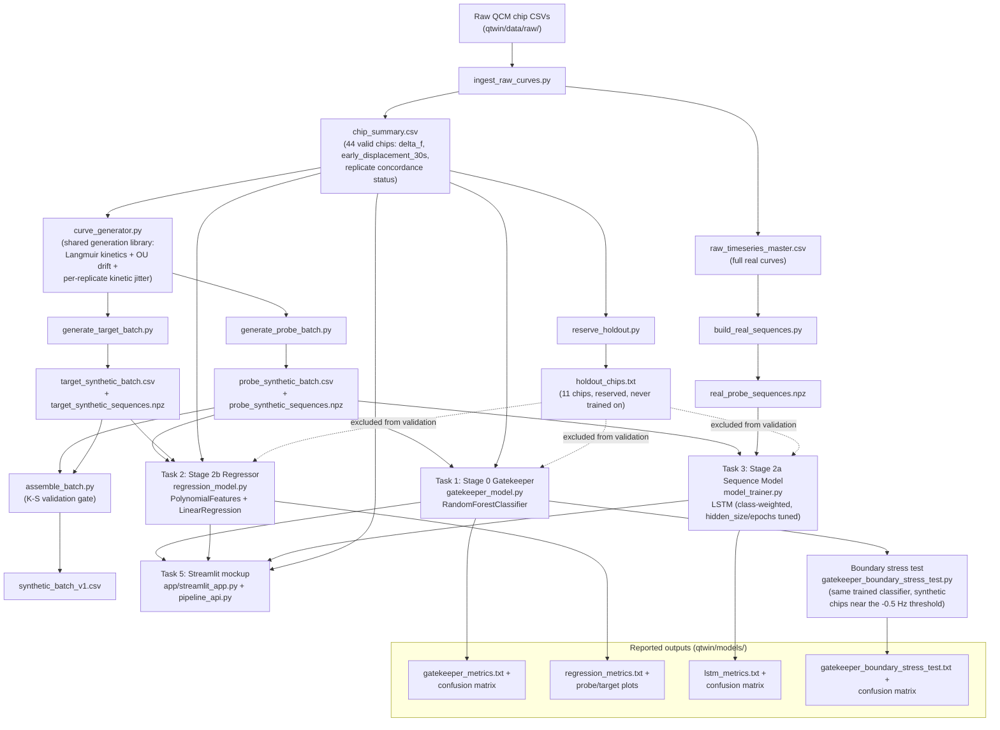

# Q-Twin Week 3 AI pipeline architecture

Per the Week 3 action-items checklist ("ส่งมอบผลลัพธ์โมเดล... และแผนภาพสถาปัตยกรรม AI").
Shows how raw lab data flows through to the three Week 3 models and the
Streamlit mockup. GitHub renders this diagram inline.

## Notes on what this diagram is (and isn't) claiming

- Every arrow is an actual file dependency in the repo, not a conceptual
  simplification -- trace any box back to the script/file named on it.
- The hold-out set (dashed lines) is structurally excluded from every
  model's training AND validation this week, per Week 2 Task 6's plan --
  it's reserved for a later, not-yet-run evaluation pass.
- `curve_generator.py`'s per-replicate kinetic jitter (feeding both
  synthetic batches) is the Week 3 Task 4 fix -- see
  `Task4_Replicate_Divergence_Investigation.md` for why it exists and how
  it was calibrated.
